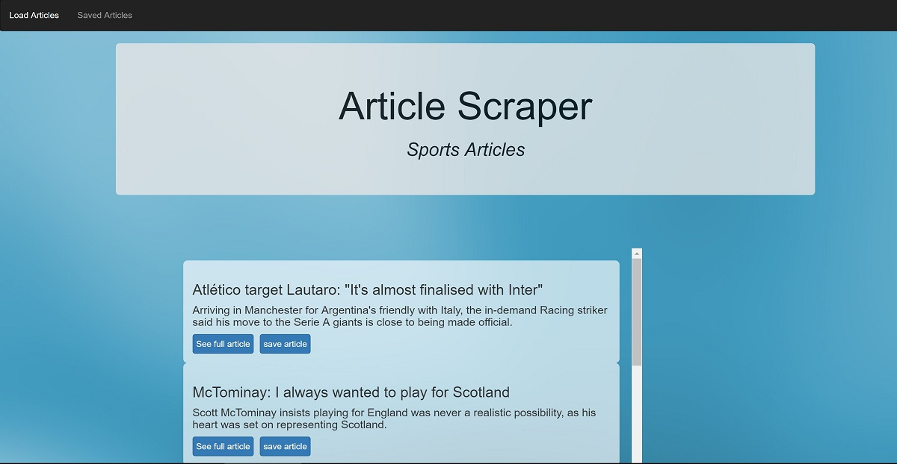
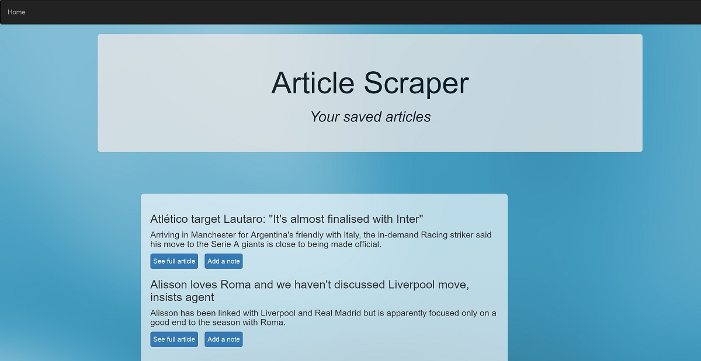

# mongo-scraper
Web app that lets users view and leave comments on the latest sport news using Mongoose and Cheerio Scraper. 
The user will be able to download the latest 15 articles, read them or store them in the database to read them later. 
In addition, comments can be asociated (or removed) to the saved articles.

<h3>Technologies used</h3>
- Express to handle routing  
- Heroku to deploy and host the app  
- Mongoose  
- Body-parser  
- Cheerio Scraper 
- Handlebars

<h3>Screenshots</h3>

<h3>Link to the app in Heroku</h3>
https://gentle-retreat-14690.herokuapp.com/